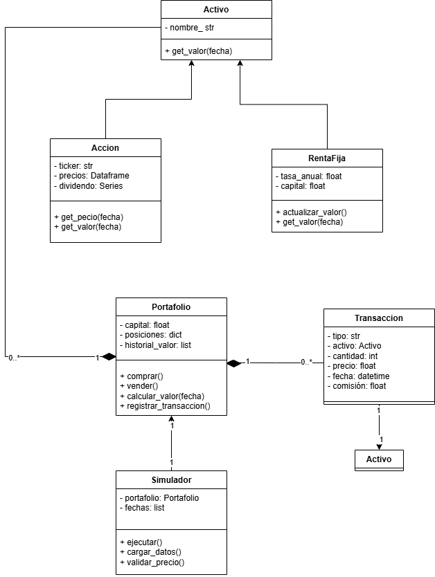

# Simulador de Portafolio de Inversión

## Descripción
Este proyecto consiste en el desarrollo de un simulador financiero que permite gestionar un portafolio de inversión compuesto por activos de renta variable. El sistema permite realizar operaciones de compra y venta de acciones utilizando datos reales del mercado, así como calcular el valor total del portafolio en tiempo real.

Adicionalmente, el simulador incluye una funcionalidad de análisis que permite visualizar la evolución histórica del portafolio y calcular su rentabilidad.

## Funcionalidades
- Gestión de portafolio con capital inicial
- Compra y venta de acciones
- Obtención de precios reales mediante yfinance
- Cálculo del valor total del portafolio
- Simulación de la evolución del portafolio en el tiempo
- Cálculo de rentabilidad
- Descarga de portafolio en .pdf
- Interfaz gráfica desarrollada con Streamlit

## Estructura
- activos.py: Define las clases Activo y Accion 
- cdt.py Define la clase para rentafija
- portafolio.py: Contiene la lógica del portafolio (compra, venta, cálculo de valor y simulación)
- interfaz.py: Implementa la interfaz gráfica usando Streamlit
- requirements.txt: Dependencias necesarias del proyecto

## UML

## Instalación
1. Clonar el repositorio:

git clone <https://github.com/valvlz/SimuladorInversion.git>
cd Simulador_Portafolio

2. Crear entorno virtual:

python -m venv venv
venv\Scripts\activate

3. Instalar dependencias:
pip install -r requirements.txt

## Ejecución
Para ejecutar la aplicación:

streamlit run interfaz.py

## Uso
1. Ingresar el ticker de la acción (por ejemplo: AAPL, MSFT)
2. Ingresar la cantidad
3. Utilizar los botones disponibles:
    - Comprar
    - Ver portafolio
    - Valor total
    - Simular evolución
4. La simulación permite visualizar el comportamiento histórico del portafolio y calcular su rentabilidad.